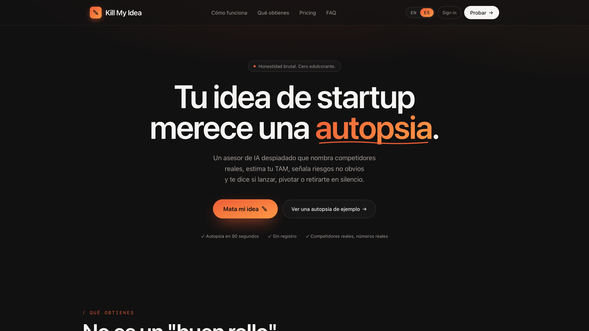
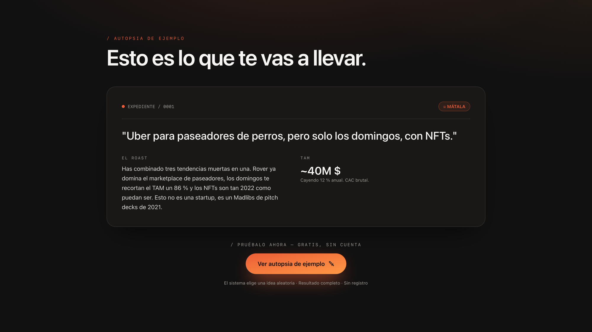
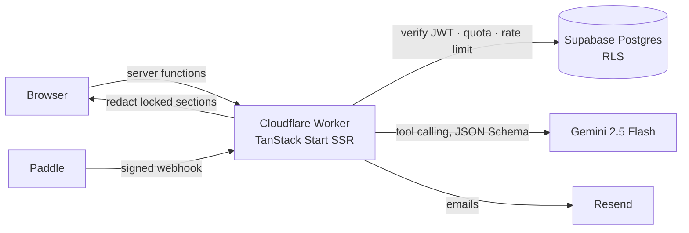

# Kill My Idea

**A brutally honest AI startup advisor.** Describe an idea and about 90 seconds later you get an autopsy: scores on 12 dimensions, a verdict (ship, pivot or kill), market size, named competitors, the Big Tech threat, startups that already died trying, a business model, a go-to-market plan and a roadmap.

Live at **[killmyidea.es](https://killmyidea.es)** · English and Spanish



## Why

Founders live in a confirmation bubble: friends and family validate by default, and a general-purpose chatbot tends to be polite and vague. Kill My Idea is built to do the opposite. It names real companies, puts numbers on the market and ends with a clear verdict.



## What's in a report

| Section     | Contents                                                                  |
| ----------- | ------------------------------------------------------------------------- |
| Verdict     | Ship, pivot or kill, the score behind it and a one-paragraph roast        |
| Market      | TAM, SAM and SOM with reasoning, optionally scoped to one country         |
| Competition | 5–7 named competitors, the Big Tech threat and similar startups that died |
| Customers   | 3 ideal customer profiles, with willingness to pay and where to find them |
| Business    | Business model, pricing, CAC and LTV, go-to-market plan                   |
| Build       | Recommended stack and a ready-to-paste prompt to scaffold the MVP         |
| Plan        | Roadmap from week 1 to year 1, risks, kill switches and name ideas        |

Reports export to Markdown, JSON or an "AI briefing" to paste into another assistant. Founders can add context or push back on an assumption, and the analysis takes it into account.

## How it works



- **Structured output, not free text.** The model has to call a single `submit_analysis` tool whose arguments follow a JSON Schema with dozens of fields. The result is validated and normalised before it is stored, so the UI never renders half a report.
- **The paywall runs on the server.** Locked sections are removed in the Worker before the response leaves, so they are never sent to the browser and hidden with CSS.
- **AI spend is protected in Postgres.** Monthly quotas are reserved atomically before the AI call and released if it fails. Per-user and per-IP rate limits use an atomic upsert in a `SECURITY DEFINER` function that only the service role can call, so they hold across Worker instances.
- **Payments are idempotent and retry-safe.** Every Paddle event is reserved by id before it is applied. If a database write fails, the reservation is released and the webhook returns 500, so Paddle's retry is processed instead of being skipped as a duplicate. Prices are resolved on the server; client-supplied product ids are never trusted.
- **Identity comes from the server.** Each server function verifies the Supabase access token itself. The `userId` sent to checkout comes from that verified context, not from the request body.

These guarantees are covered by tests in [`tests/backend`](tests/backend).

## Stack

TanStack Start (React 19, SSR) · Tailwind CSS 4 · shadcn/ui · Supabase (Auth, Postgres, RLS) · Gemini 2.5 Flash (OpenAI-compatible API) · Paddle (merchant of record) · Resend · Cloudflare Workers · Vitest

## Run it locally

```bash
npm ci
cp .env.example .env            # Supabase project and Paddle client token
npm run dev
```

Server-side secrets (Supabase service role, Google AI key, Paddle and Resend) are listed in [`wrangler.jsonc`](wrangler.jsonc). The database is in [`supabase/migrations`](supabase/migrations).

**About the prompts:** the production prompts are not in this repository. A clone uses the generic ones in [`src/lib/prompts/example.ts`](src/lib/prompts/example.ts), which follow the same schema, so the app works end to end with less detailed reports. A production build fails without the private prompts unless `ALLOW_EXAMPLE_PROMPTS=1` is set.

```bash
npm run lint && npm run typecheck && npm test
```

## Team

Built by [Álvaro Carpintero](https://alvarocarpintero.com) and [Ángel Martin](https://github.com/aaangelmartin).

© 2026 Álvaro Carpintero and Ángel Martin. All rights reserved. The source is public so it can be read; it is not licensed for reuse.
